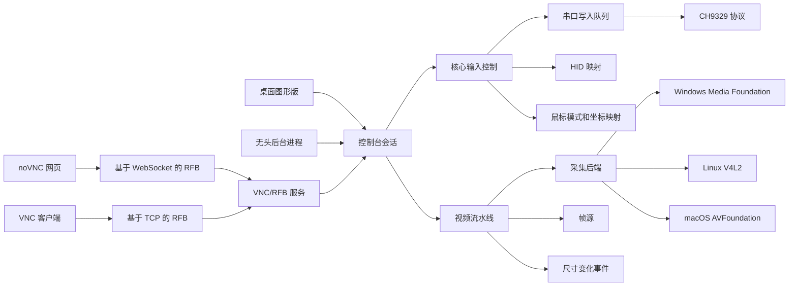

# my_ipkvm 粗粒度方案与设计草案

日期：2026-07-31

## 目标

做一个机房内软件 IPKVM：一台主控机通过 USB HDMI 采集卡读取目标机控制台画面，通过 CH9329 + CH340 串口线向目标机注入 USB HID 键盘鼠标事件。

目标形态分两版：

- 桌面图形版：类似 VNC 客户端，本机窗口显示采集卡画面，窗口获得焦点时转发键盘和鼠标事件。
- 无头版：后台进程运行，对外提供 VNC/RFB 服务，并内置 noVNC 网页。普通 VNC 客户端和浏览器都能连接。

本设计不基于 Qt/PyQt 实现。`kvm-serial` 只作为协议和产品行为参考，不继承它的 PyQt 图形界面。

当前不做完整安全子系统。鉴权、TLS、访问控制、审计、公网暴露、反向代理、VPN、会话权限等都视为后续可叠加层；但默认监听地址固定为 `127.0.0.1`，只有显式配置才允许监听其他地址。

## 总体结论

推荐从头写 Rust 项目。理由：

- CH9329 协议简单，适合做成小而稳定的核心模块。
- Rust 适合把桌面图形界面、串口、视频采集、RFB/VNC、网页服务统一到一个类型安全的工程内。
- 可以默认使用 MIT、Apache、BSD、ISC、Zlib、MPL-2.0 这类可接受依赖，避免 PyQt GPL。
- 如需 LGPL，限定在动态链接的 C/C++ 系统库或媒体库边界，避免普通 Cargo 依赖静态编入主二进制。

无头版不做 RDP 服务端。RDP 是完整桌面远程协议栈，复杂度远高于本项目需要；本项目只有 HDMI 像素流和 HID 输入，和 VNC/RFB 的远程帧缓冲模型天然匹配。

Go 可用于无头后台进程，但不推荐作为桌面主实现。Go 的网页视图类桌面框架会让键盘捕获更接近浏览器限制，和“VNC 裸窗口”目标有冲突。

## 当前范围

当前最小版本包含：

- CH9329 串口协议。
- CH9329 设备探测、信息读取和在线状态。
- 串口波特率手动选择，出厂默认值为 9600。
- USB HID 键盘鼠标映射。
- 键盘状态机：重复按下去重、失焦释放、6KRO 溢出策略。
- 鼠标绝对模式和相对模式。
- USB HDMI 采集卡视频输入。
- 视频尺寸动态变化事件。
- 桌面本地控制台窗口。
- 无头版 VNC/RFB 服务。
- RFB `DesktopSize` 伪编码。
- 内置 noVNC 网页。
- 剪贴板文本转模拟键入。
- 设备枚举和手动选择。
- 单目标机、单采集卡、单串口会话。
- 状态接口和快照接口。

当前最小版本明确不做：

- RDP 服务端。
- Qt、PyQt、PySide。
- GPL 依赖进入主程序。
- 复用 LibVNCServer/TightVNC 代码。
- H.264/WebRTC 低带宽压缩。
- 双向剪贴板同步。
- 多目标机管理。
- 多用户并发控制仲裁。
- 音频。
- 文件传输。
- 虚拟介质。
- ATX 开关或其他硬件电源控制。
- CH9350L 支持。
- 完整安全子系统、鉴权、TLS、公网访问。

## 许可证策略

默认策略：

- 允许：MIT、Apache-2.0、BSD、ISC、Zlib、MPL-2.0、系统 SDK。
- 可接受但需隔离：LGPL 动态库，例如 GStreamer、LGPL 构建的 FFmpeg、平台媒体库包装层。
- 不接受：GPL 依赖进入主程序分发包，除非以后明确决定整项目 GPL。
- 不采用：PyQt 免费版，因为它是 GPL/商业版双许可，不是 LGPL。

Rust 具体规则：

- 普通 Cargo 依赖会静态链接进最终二进制，因此不把 LGPL Rust 库当普通依赖使用。
- 如果必须使用 LGPL Rust 代码，将其拆成独立 `cdylib` 或独立进程，通过 C ABI 或 IPC 调用。
- FFmpeg/GStreamer 不进入当前最小版本；以后如使用，优先动态加载或动态链接，并在发布包内保留许可证说明、源码获取方式和替换库说明。
- noVNC 核心库是 MPL-2.0，可以作为网页前端依赖；若修改 noVNC 自身文件，修改过的文件按 MPL-2.0 保留。
- MJPEG 解码优先评估 libjpeg-turbo。其许可证属于 BSD 风格/IJG 风格，可进入白名单，但 Rust 绑定和分发方式仍需单独审计。

## 运行时决策

I/O 运行时固定使用 tokio：

- HTTP、RFB over TCP、RFB over WebSocket、串口任务、后台状态推送都按 tokio 生态实现。
- 后续 HTTP 优先评估 axum，WebSocket 优先评估 tokio-tungstenite，串口优先评估 tokio-serial。
- `ipkvm-core` 保持同步、无 tokio 依赖；它只定义协议、输入状态机、错误和串口写入队列接口。
- `ipkvm-video` 可以暴露 tokio watch 订阅接口，用于多个消费者读取同一最新帧。
- 异步任务边界放在 `ipkvm-headless`、真实采集后端和真实串口后端，不把 async 签名扩散到纯协议类型。

## 架构



核心边界：

- `ipkvm-core` 不依赖图形界面、不依赖网页服务、不依赖 VNC、不依赖具体视频库。
- `ipkvm-video` 不知道 CH9329，只产出视频帧流和尺寸变化事件。
- `ipkvm-session` 组合视频帧源、尺寸变化事件和输入接收端。
- `ipkvm-desktop` 使用会话，负责窗口、输入事件、视频显示、DPI 换算和桌面鼠标捕获。
- `ipkvm-headless` 使用会话，负责后台进程生命周期、设备选择、HTTP/noVNC、RFB 监听、状态接口和快照接口。
- `ipkvm-rfb` 是对外协议入口，不是内部核心；它只依赖 `ipkvm-core` 和 `ipkvm-video` 抽象，不依赖 `ipkvm-session`。
- 所有输入事件进入同一个串口写入队列，避免来自多个入口的 CH9329 帧交错。

建议模块拆分：

```text
ipkvm-core       CH9329 帧、HID 报告、坐标换算、输入状态机、串口写入队列接口
ipkvm-video      采集设备枚举、格式选择、视频帧流、尺寸变化事件
ipkvm-session    把视频帧源、尺寸变化事件和输入接收端组合成控制台会话
ipkvm-rfb        最小 VNC/RFB 服务，支持 TCP 和 WebSocket 传输
ipkvm-desktop    本地图形界面
ipkvm-headless   后台进程、HTTP、noVNC 静态文件、状态接口、配置
```

## 核心接口

### `ipkvm-core`

职责：

- CH9329 帧构造：`57 AB + addr + cmd + len + data + checksum`。
- CH9329 设备探测：打开候选串口后使用读信息命令探测合法回包。
- CH9329 在线状态：读信息命令可返回芯片版本、USB 枚举状态和 Num Lock、Caps Lock、Scroll Lock 指示灯状态。
- CH9329 波特率：默认使用出厂值 9600，允许用户手动选择其他值；硬件到货前不自动改写芯片参数。
- CH9329 应答：协议层支持正常和异常应答解析；真实传输层是否逐命令等待应答，由硬件诊断结果决定。
- 键盘 HID 报告：维护当前按下的修饰键和最多 6 个普通键。
- 键盘状态机：重复 `key_down` 去重，失焦/断连/控制者切换时触发 `release_all()`。
- 6KRO 溢出策略：第 7 个普通键按下时拒绝新键，保留当前已按下键，并记录丢弃计数。
- 鼠标报告：绝对坐标、相对位移、滚轮、按钮状态。
- 鼠标模式：绝对模式和相对模式可切换。
- 坐标换算：客户端坐标 -> 视频源像素坐标 -> CH9329 的 0..4095 坐标。
- 设备状态：串口连接状态、协议统计、最后发送时间、错误状态、丢弃输入计数。

关键接口草案：

```text
SerialDevice
  list() -> Vec<SerialPortInfo>
  probe(path, baud_candidates) -> ProbeResult
  open(path, baud) -> SerialSession

CommandQueue
  enqueue_batch(frames)
  stats()

Ch9329Device
  read_info()
  set_baud_rate(baud)
  send_keyboard(report)
  release_all_keys()
  send_mouse_absolute(buttons, x, y, width, height, wheel)
  send_mouse_relative(buttons, dx, dy, wheel)

InputSink
  set_mouse_mode(mode)
  handle_key(event) -> Result
  handle_pointer(event) -> Result
  release_all() -> Result
```

`InputSink` 契约：

- `KeyEvent` 仍区分按下和释放，但只通过 `handle_key` 进入 sink，避免 `key_down(KeyEvent::Up)` 这种自相矛盾调用。
- `PointerEvent::AbsoluteMove` 使用帧缓冲像素坐标和帧尺寸，不直接传 CH9329 的 0..4095 坐标。
- CH9329 绝对坐标换算留在 sink 实现内，桌面端和 RFB 端复用同一路径。
- 滚轮方向约定为正数向上、负数向下。
- 滚轮值的语义是滚轮齿数；各平台的原始滚轮单位由入口适配层归一化。
- 所有输入方法返回 `Result`，队列关闭、不可映射按键、6KRO 溢出等错误必须能传回 UI 或 RFB 状态层。
- `Result::Ok` 只表示有序命令批次已被本进程接受，不表示 CH9329 已执行。
- 文本粘贴转模拟键入不放进物理 `InputSink`，阶段 2 由独立文本键入服务实现。

CH9329 协议与输入核心的详细设计见：

- `docs/superpowers/specs/2026-07-31-ch9329-protocol-input-core-design.md`

第一版只支持 CH9329。CH9350L 作为后续扩展，不进当前最小版本。

### `ipkvm-video`

职责：

- 枚举采集设备。
- 枚举和选择格式：分辨率、帧率、像素格式、是否 MJPEG。
- 自动格式选择：1080p 优先 MJPEG；未压缩 YUY2/NV12 只在带宽和帧率可接受时选择。
- 输出统一的视频帧流。
- 对外提供最新帧缓存和订阅接口。
- 当采集卡输出尺寸变化时发出尺寸变化事件。

数据类型草案：

```text
VideoDeviceInfo
  id
  display_name
  backend
  supported_formats

VideoFormat
  width
  height
  fps
  pixel_format: YUY2 | NV12 | RGB | MJPEG | H264 | Unknown

VideoFrame
  seq
  timestamp
  width
  height
  stride
  format
  data: Arc<[u8]>

FrameSource
  latest_frame() -> Option<Arc<VideoFrame>>
  subscribe() -> FrameReceiver

VideoEvent
  Frame(frame)
  SizeChanged(width, height)
  SignalLost
  SignalRestored(width, height)
```

视频处理分三阶段：

- 第一阶段：本地桌面显示，采集未压缩帧或 MJPEG 解码后的帧，直接渲染。
- 第二阶段：RFB 服务使用 RGBX/BGRA 帧缓冲。第一版允许整帧更新、尺寸变化通知和帧率限制。
- 第三阶段：补充 RFB 压缩编码或独立 WebRTC/H.264/VP8，不自己实现视频编码器。

帧所有权模型：

- `VideoFrame` 使用共享所有权，避免桌面渲染器和多个 RFB 客户端复制 1080p 大帧。
- `seq` 是单调递增帧序号，用于慢客户端丢帧、重复帧判断和后续脏块检测。
- `timestamp` 是单调时间戳，不表示墙钟时间。
- `stride` 必须显式记录，不能假设行宽等于 `width * bytes_per_pixel`。
- `VideoFrame` 不做整帧字节相等比较。

采集卡现实约束：

- USB 2.0 廉价采集卡在 1080p 下通常需要 MJPEG 才能达到可用帧率。
- 廉价采集卡的 EDID 通常固定且不可修改，目标机可用分辨率上限会被采集卡限制。
- 硬件到货后必须记录采集卡在 BIOS、引导加载器、操作系统阶段的分辨率变化序列。

### `ipkvm-session`

职责：

- 管理一个目标控制台会话。
- 固定本次会话的视频设备和串口设备。
- 允许本次会话的视频尺寸动态变化。
- 将输入入口发来的键鼠事件统一送入 `InputSink`。
- 将采集帧和尺寸变化事件统一发布给桌面渲染器和 RFB 服务。
- 维护当前控制者、查看者、帧率、串口统计、丢帧计数、最后输入时间。

会话配置至少包含：

- 视频设备 ID。
- 串口路径。
- 选定视频格式或格式选择策略。
- 波特率，默认 9600。
- 键盘布局，当前默认 `en_US`。
- 鼠标模式，默认绝对模式。

会话约束：

- 当前最小版本一个进程只管理一个活动会话。
- 会话启动后视频设备固定；分辨率变化不需要重连。
- 当前最小版本支持多个查看者，但只有一个控制者。
- 串口断开时视频继续运行，输入返回错误并尝试触发 `release_all()`。
- 视频断开时 RFB/图形界面保留连接，但显示合成错误帧或黑帧。

## 桌面图形版设计

推荐技术：

- 窗口和事件循环：`winit`
- 界面：`egui` 或极简自绘设置页
- 渲染：`wgpu` 或 `pixels`

交互：

- 启动显示设置页：选择视频设备、分辨率、串口、波特率、键盘布局、鼠标模式。
- 连接成功后进入控制台视图：黑底视频裸窗口，少量覆盖状态可隐藏。
- 窗口按视频比例缩放。用户可拖动大小，但内容保持比例，不变形。
- 视频尺寸变化时，窗口比例和坐标换算立即更新。
- 焦点在视频视图内时，捕获可捕获的键盘事件并发送。
- 视频视图失去焦点时无条件发送 `release_all()`。
- 主控系统会优先处理 `Alt+Tab`、`Win`、`Ctrl+Alt+Del` 等快捷键；这类组合键通过菜单或屏幕键盘发送。
- 绝对鼠标模式：只有指针在视频区域上方时，发送移动、按钮、滚轮事件。
- 相对鼠标模式：桌面端使用 `winit` 的鼠标捕获或限制能力，按相对位移发送 CH9329 相对鼠标报告。
- 相对鼠标模式使用 1:1 无加速映射；目标机侧速度/加速度导致的漂移视为硬件和操作系统现实约束。
- 点击前先发送一次位置更新，再发送按钮事件，避免在旧坐标点击。
- 提供菜单或屏幕键盘发送 `Ctrl+Alt+Del`、F 键、导航键、释放所有按键、截图。
- 坐标换算必须使用物理像素和 DPI 缩放因子，单元测试覆盖 1.25、1.5 这类非整数缩放。

桌面版第一版不做全屏，只保留后续扩展位。YUY2/NV12 到 RGB 的 GPU shader 转换作为 `wgpu` 路径优先方案，`pixels` 软渲染路径作为兜底。

## 无头版 VNC/网页设计

### 对外入口

无头版提供两个入口：

```text
TCP 5900       标准 RFB/VNC 服务，供普通 VNC 客户端使用
HTTP 6080      设备选择页、noVNC 静态页面、RFB WebSocket 入口
```

默认绑定：

- 默认监听 `127.0.0.1`。
- 只有显式设置 `--bind` 或配置文件字段时才监听其他地址。
- 这不是完整安全方案，只是避免默认暴露无鉴权控制台。

网页不再自研远控协议。它只负责：

- 枚举视频和串口设备。
- 创建或重启控制台会话。
- 嵌入 noVNC 客户端。
- 把 noVNC 连接到本进程的 RFB WebSocket 入口。
- 展示当前状态、快照、鼠标模式、控制者状态和特殊按键。

建议 HTTP 路由：

```text
GET  /                  设置页
GET  /api/devices       视频和串口设备列表
POST /api/session       启动或重启会话
GET  /api/status        当前帧率、串口统计、最后输入时间、丢帧计数、活动客户端数
GET  /api/screenshot    最新帧 JPEG 快照
GET  /novnc/...         noVNC 静态资源
GET  /rfb               基于 WebSocket 的 RFB
```

noVNC 静态资源打包：

- 当前最小版本将 noVNC 静态资源内嵌进二进制，发布形态为单文件加配置文件。
- 可评估 `include_dir` 或 `rust-embed`，进入依赖前需要许可证审计。
- noVNC 版本固定，发布包保留 noVNC 和其第三方静态资源的许可证说明。

### RFB/VNC 服务

当前最小版本实现 RFB 3.8 子集：

- `ProtocolVersion` 握手。
- `SecurityType None`。完整安全子系统不在当前范围内。
- `ClientInit` / `ServerInit`。
- `SetPixelFormat`。
- `SetEncodings`。
- `FramebufferUpdateRequest`。
- `FramebufferUpdate`。
- `DesktopSize` 伪编码。
- `KeyEvent`。
- `PointerEvent`。
- `ClientCutText` 转模拟键入。

当前最小版本的编码支持：

- 必须支持 `Raw`。
- 必须支持 `DesktopSize` 伪编码，用于目标机启动过程中分辨率变化。
- 初始实现整帧更新，限制帧率，先保证行为正确。
- 识别但不实现的伪编码必须正确忽略，不能断连；测试覆盖未知伪编码和 `EnableContinuousUpdates` 请求。
- 后续再做脏块检测，减少静态画面带宽。
- `ZRLE`、`Tight/JPEG`、H.264 扩展都不进当前最小版本。

像素格式：

- 内部统一为 `RGBX8888` 或 `BGRA8888`。
- RFB 根据客户端像素格式做必要转换。
- 第一版可只优化常见 32 位真彩格式，其他格式走慢路径或拒绝。

WebSocket 兼容：

- RFB over WebSocket 必须发送二进制 WebSocket 帧。
- 如果客户端请求 `Sec-WebSocket-Protocol: binary`，服务端可以回应该子协议以兼容旧代理和旧客户端。
- 现代 noVNC 不应强制依赖非标准 `binary` 子协议；实际行为以当前锁定的 noVNC 版本测试为准。

输入映射：

- RFB 的 `KeyEvent` 使用 keysym，需要映射到 USB HID 用法编号。
- 当前最小版本只保证 `en_US` 键盘布局、修饰键、F1-F12、方向键、导航键、小键盘常用键。
- OS 自动重复产生的重复 `key_down` 必须去重。
- 非 ASCII 文本输入暂不保证。
- `ClientCutText` 和桌面粘贴只做“文本转模拟键入”，不是双向剪贴板同步。
- CH9329 `GetInfo` 可以读取目标机 Num Lock、Caps Lock、Scroll Lock LED 状态；文本键入前可以查询并据此选择修饰键。
- 锁定键状态仍可能在查询后被目标机或其他键盘改变，因此文本键入必须保留“状态可能竞争”的限制说明。
- RFB 的 `PointerEvent` 坐标直接对应帧缓冲像素坐标，再映射到 CH9329 的 0..4095。
- VNC 按钮掩码映射左键、中键、右键和滚轮；额外鼠标键不进当前最小版本。
- 网页相对鼠标模式需要浏览器 Pointer Lock。若 noVNC 集成无法直接提供相对位移，则需要定制 noVNC 页面层；这项不假定 noVNC 原生完成。

会话和并发：

- 当前最小版本支持多个查看者观察同一帧缓冲。
- 当前最小版本同一时间只允许一个控制者发送输入。
- 多个客户端同时连接时，第一个连接者获得输入控制权；其他客户端只读观看。
- 控制者断开或切换时，先发送 `release_all()`。
- 每个客户端有自己的帧更新节流和反压处理。慢客户端只拿最新帧，旧帧直接丢弃。

## 视频压缩策略

桌面图形版不需要做视频压缩，只需要采集和渲染。

无头版第一版也不直接进入视频编码。VNC/RFB 当前最小版本使用 `Raw` 编码加帧率限制，用于验证协议兼容性和控制台操作闭环。

后续优化顺序：

1. 脏块检测
   - 对帧缓冲分块计算摘要，只发送变化块。
   - 对 BIOS、终端、安装器这类静态画面收益大。

2. RFB 压缩编码
   - 优先调研 `ZRLE` 或 `Tight/JPEG`。
   - 只有确认许可证和复杂度可控后再进入实现。

3. 采集卡 MJPEG 透传和解码优化
   - 如果 UVC 设备已经输出 MJPEG，优先避免 CPU 重新编码。
   - 解码优先评估 libjpeg-turbo，不引入完整 FFmpeg。
   - 可另做原生网页视频流或 RFB JPEG 路径。

4. WebRTC/H.264/VP8
   - 用于跨公网、低带宽、多客户端。
   - 不自己写视频编码器。
   - Windows 用 Media Foundation H.264 编码器。
   - macOS 用 VideoToolbox。
   - Linux 优先考虑 GStreamer 或平台硬件编码栈。

## 平台优先级

建议按工作站实际环境优先：

1. Windows 主控机最小版本
   - 当前开发环境在 Windows。
   - Media Foundation 是新代码推荐路径。
   - CH340 串口验证方便。

2. 无头 VNC/网页最小版本
   - 可先在 Windows 上使用模拟视频源验证 noVNC 和普通 VNC 客户端兼容性。
   - 硬件到货后接真实采集卡和 CH9329。

3. Linux 主控机
   - 机房服务器常见。
   - V4L2 对 UVC 采集卡最直接。
   - 适合后台进程部署。

4. macOS 主控机
   - 支持价值较低，可后置。
   - AVFoundation/VideoToolbox 路径清晰，但打包权限和签名额外麻烦。

## 阶段计划

### 阶段 0：硬件到货前

已完成：

- 建立 Rust 工作区。
- 固定 tokio 作为 I/O 运行时。
- 建立 `[workspace.dependencies]` 集中管理外部依赖版本。
- 建立最小 CI：格式检查和 `cargo test --workspace --all-features`。
- 完成 CH9329 命令帧、类型化 HID 报告、应答解析和增量解帧，并覆盖协议金样、错误恢复和性质测试。
- 写键盘状态机测试：重复按下去重、6KRO 溢出、释放所有键。
- 写鼠标状态机测试：按钮组合、绝对坐标、相对位移拆包、模式切换和释放。
- 写坐标换算测试，覆盖厂家示例；桌面适配层后续覆盖非整数 DPI 缩放。
- 写模拟视频源，支持尺寸变化事件。
- 写 fake 命令队列和有序批次提交测试。
- `ipkvm-video` 使用 `mock` feature 提供测试帧源。
- `ipkvm-core` 使用 `mock` feature 提供 fake 命令队列。
- 将会话默认串口波特率设为 CH9329 出厂值 9600。

待完成：

- 写 HID 用法编号到桌面和 RFB 键值的映射基础表。
- 写 RFB 3.8 握手、`Raw` 编码、`DesktopSize` 伪编码协议样例测试。
- 写未知伪编码忽略测试。
- 用模拟帧缓冲跑通普通 VNC 客户端和 noVNC。
- 确定依赖许可证白名单。

### 阶段 1：桌面本地最小版本

- Windows 串口枚举和打开。
- CH9329 设备探测、`GetInfo` 和在线状态。
- 默认以 9600 打开；支持手动选择其他波特率。
- 使用诊断工具验证应答、锁定键 LED 和 115200 后，再决定是否增加自动切换。
- Windows 视频设备枚举。
- 自动格式选择，1080p 优先 MJPEG。
- 选择设备后进入控制台窗口。
- 显示 720p/1080p 视频。
- 视频尺寸变化时更新窗口比例和坐标换算。
- 键盘普通键、修饰键、F1-F12、方向键、导航键转发。
- 键盘重复按下去重。
- 失焦、窗口关闭、串口断开时释放所有键。
- 鼠标绝对移动、相对移动、左键、右键、中键、滚轮转发。
- 桌面端绝对/相对鼠标模式切换。
- 释放所有键、发送 `Ctrl+Alt+Del`、截图。
- 屏幕键盘覆盖层，至少支持特殊组合键和 F 键。

### 阶段 2：无头 VNC/网页最小版本

- 无头后台进程。
- 默认绑定 `127.0.0.1`。
- HTTP 设置页。
- noVNC 静态资源内嵌。
- 基于 TCP 的 RFB。
- 基于 WebSocket 的 RFB。
- `Raw` 帧缓冲更新。
- `DesktopSize` 伪编码。
- RFB `KeyEvent` 到 HID 映射。
- RFB `PointerEvent` 到 CH9329 绝对鼠标。
- RFB `ClientCutText` 转模拟键入。
- 网页特殊按键和基础屏幕键盘。
- 单控制者策略。
- 慢客户端丢帧策略。
- `/api/status` 状态接口。
- `/api/screenshot` 最新帧 JPEG 快照接口。

### 阶段 3：Linux 主控机

- Linux 串口枚举。
- Linux V4L2 采集。
- 复用阶段 2 的 RFB/noVNC 入口。
- systemd 服务草案。

### 阶段 4：性能优化

- 脏块检测。
- RFB 帧率控制和延迟指标。
- RFB `ZRLE` 或 `Tight/JPEG` 验证。
- 采集卡 MJPEG 透传验证。
- libjpeg-turbo 解码路径验证。
- Windows H.264 Media Foundation 编码器验证。
- WebRTC 验证。
- 桌面端 YUY2/NV12 到 RGB 的 GPU shader 转换。

### 阶段 5：运维化、安全叠加和辅助能力

- 配置文件。
- Windows 服务或托盘程序。
- 多设备配置档案。
- 连接健康检查。
- 发布包和许可证清单。
- Wake-on-LAN。
- 输入事件日志和审计。
- 帧录制。
- 鉴权、TLS、访问控制、审计、反向代理/VPN 部署文档。

## 风险排除表

当前阶段通过收窄范围和前置关键协议能力排除这些风险：

| 风险点 | 当前设计处理 |
| --- | --- |
| RDP 协议复杂度 | 不做 RDP 服务端，只保留未来调研可能 |
| PyQt/Qt 许可风险 | 不使用 Qt/PyQt/PySide |
| GPL 传染风险 | 不使用 LibVNCServer/TightVNC 等 GPL 代码 |
| 浏览器远控界面自研风险 | 网页版复用 noVNC |
| 自研 WebSocket 输入协议风险 | 无头版输入走 RFB `KeyEvent`/`PointerEvent` |
| BIOS 到 OS 过程分辨率变化 | 当前最小版本支持视频尺寸变化事件和 RFB `DesktopSize` |
| BIOS 绝对鼠标不兼容 | 当前最小版本支持相对鼠标模式 |
| 按键卡住 | 失焦、断连、控制者切换时发送 `release_all()` |
| OS 自动重复按键 | 键盘状态机去重重复 `key_down` |
| 6KRO 溢出 | 拒绝第 7 个普通键并记录丢弃计数 |
| 多入口串口帧交错 | 所有输入经由单一串口写入队列 |
| H.264/WebRTC 工程复杂度 | 不进当前最小版本 |
| 视频编码器许可风险 | 当前最小版本不引入 FFmpeg/GStreamer |
| RFB `Raw` 带宽风险 | 当前最小版本用于验证闭环，限制帧率；性能优化后置 |
| 键盘布局差异 | 当前最小版本只承诺 `en_US` HID 映射 |
| Caps Lock/NumLock 状态竞争 | 使用 `GetInfo` 读取 LED 状态；文本键入仍说明查询后状态可能变化 |
| 多客户端输入冲突 | 当前最小版本单控制者 |
| 设备热插拔复杂度 | 当前最小版本断开后手动重连 |
| CH9350L 差异 | 当前最小版本只支持 CH9329 |
| 安全设计复杂度 | 当前不做安全子系统，默认监听 `127.0.0.1` |

仍需硬件验证的问题：

- 廉价 HDMI 采集卡实际支持的格式、帧率、MJPEG 行为和延迟。
- Windows Media Foundation 对目标采集卡的枚举、格式选择和帧读取行为。
- 目标机 BIOS/UEFI/引导菜单对 CH9329 绝对鼠标的支持情况，相对模式回退是否必要。
- CH9329 成品线默认波特率、工作模式、命令应答、读信息命令和 115200 支持情况。
- 目标机从 BIOS 到 OS 全过程中采集卡输出分辨率的变化序列。
- 采集卡 EDID 锁定的分辨率上限。
- BIOS/UEFI 环境下目标机对 CH9329 模拟键盘的兼容性。

## 关键参考资料

本地已下载：

- `docs/references/CH9329-serial-protocol-wch-20190508.pdf`
- `docs/references/CH9329-datasheet-akizuki-mirror.pdf`
- `docs/references/USB-HID-Usage-Tables-1.7.pdf`
- `docs/references/USB-Video-Class-1.5-document-set.zip`
- `docs/references/uvc-1.5/USB Video Class 1_5/UVC 1.5 Class specification.pdf`
- `docs/references/uvc-1.5/USB Video Class 1_5/USB_Video_Payload_MJPEG_1.5.pdf`
- `docs/references/uvc-1.5/USB Video Class 1_5/USB_Video_Payload_H264_1.5.pdf`
- `docs/references/uvc-1.5/USB Video Class 1_5/USB_Video_Payload_VP8_1.5.pdf`
- `docs/references/RFC6143-rfb-protocol.txt`
- `docs/references/rfbproto-community-spec.rst`
- `docs/references/noVNC-README.md`
- `docs/references/noVNC-API.md`
- `docs/references/noVNC-EMBEDDING.md`
- `docs/references/noVNC-LICENSE.txt`

在线资料：

- CH9329 数据手册官方页：https://www.wch-ic.com/downloads/CH9329DS1_PDF.html
- CH340/CH341 Windows 驱动：https://www.wch-ic.com/downloads/CH341SER_EXE.html
- USB HID 用途表 1.7：https://usb.org/document-library/hid-usage-tables-17
- USB 视频类 v1.5：https://www.usb.org/document-library/video-class-v15-document-set
- RFC 6143 RFB 协议：https://www.rfc-editor.org/rfc/rfc6143
- RFB 社区协议规格：https://github.com/rfbproto/rfbproto/blob/master/rfbproto.rst
- noVNC：https://github.com/novnc/noVNC
- noVNC 接口文档：https://github.com/novnc/noVNC/blob/master/docs/API.md
- noVNC 嵌入文档：https://github.com/novnc/noVNC/blob/master/docs/EMBEDDING.md
- noVNC 服务端要求：https://novnc.com/noVNC/
- WebSocket 子协议头说明：https://developer.mozilla.org/en-US/docs/Web/HTTP/Reference/Headers/Sec-WebSocket-Protocol
- libjpeg-turbo 许可证：https://github.com/libjpeg-turbo/libjpeg-turbo/blob/main/LICENSE.md
- Windows Media Foundation 采集：https://learn.microsoft.com/en-us/windows/win32/medfound/audio-video-capture-in-media-foundation
- Windows 视频采集设备枚举：https://learn.microsoft.com/en-us/windows/win32/medfound/enumerating-video-capture-devices
- Windows H.264 编码器：https://learn.microsoft.com/en-us/windows/win32/medfound/h-264-video-encoder
- macOS AVFoundation 采集设备选择：https://developer.apple.com/documentation/avfoundation/choosing-a-capture-device
- macOS AVCaptureVideoDataOutput：https://developer.apple.com/documentation/avfoundation/avcapturevideodataoutput
- macOS VideoToolbox：https://developer.apple.com/documentation/videotoolbox
- Linux V4L2 接口：https://docs.kernel.org/userspace-api/media/v4l/v4l2.html
- Linux V4L2 采集接口：https://www.kernel.org/doc/html/v6.4/userspace-api/media/v4l/dev-capture.html
- Linux V4L2 mmap 流式采集：https://www.kernel.org/doc/html/v4.9/media/uapi/v4l/mmap.html
- GStreamer 许可证说明：https://gstreamer.freedesktop.org/documentation/frequently-asked-questions/licensing.html
- FFmpeg 法律说明：https://www.ffmpeg.org/legal.html
- WebRTC 编码格式说明：https://developer.mozilla.org/en-US/docs/Web/Media/Guides/Formats/WebRTC_codecs
- Qt LGPL 义务说明：https://www.qt.io/development/open-source-lgpl-obligations
- PyQt 商业版/GPL 许可说明：https://riverbankcomputing.com/commercial/pyqt
- LibVNCServer 许可证说明：https://libvnc.github.io/
- Microsoft RDP 基础连接和图形远程协议：https://learn.microsoft.com/en-us/openspecs/windows_protocols/ms-rdpbcgr/5073f4ed-1e93-45e1-b039-6e30c385867c
- kvm-serial 参考项目：https://github.com/sjmf/kvm-serial

## 默认决策

- 第一版桌面图形界面不做全屏，只保留后续扩展位。
- 多个 VNC 客户端同时连接时，第一个连接者获得输入控制权；其他客户端只读观看。
- 鼠标默认使用绝对模式；BIOS/启动菜单不兼容时切到相对模式。
- 文本转模拟键入只承诺 `en_US` 可映射字符；键入前读取锁定键 LED，但不承诺查询后无状态竞争。
- CH9329 串口默认使用 9600；115200 只在硬件诊断确认后考虑自动启用。
- RFB 性能优化先做脏块检测，再评估 `ZRLE` 或 `Tight/JPEG`。
